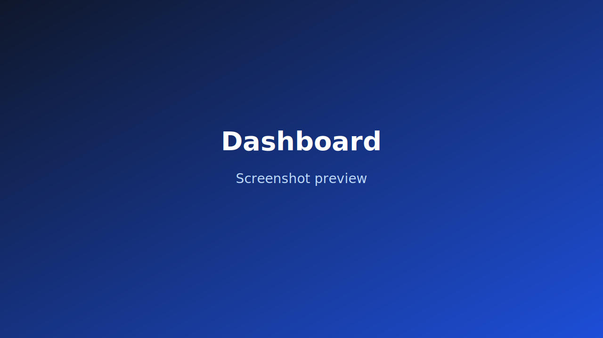
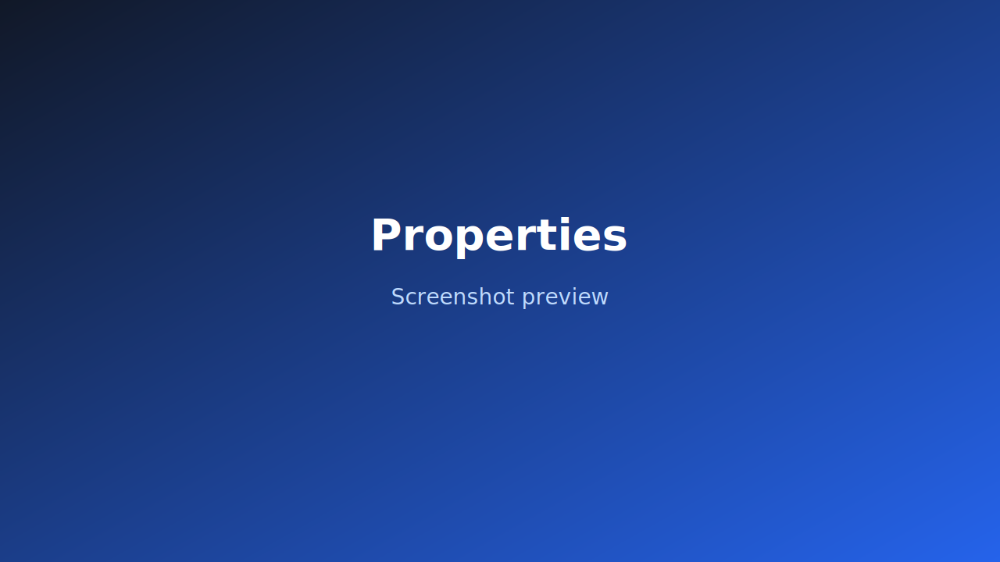
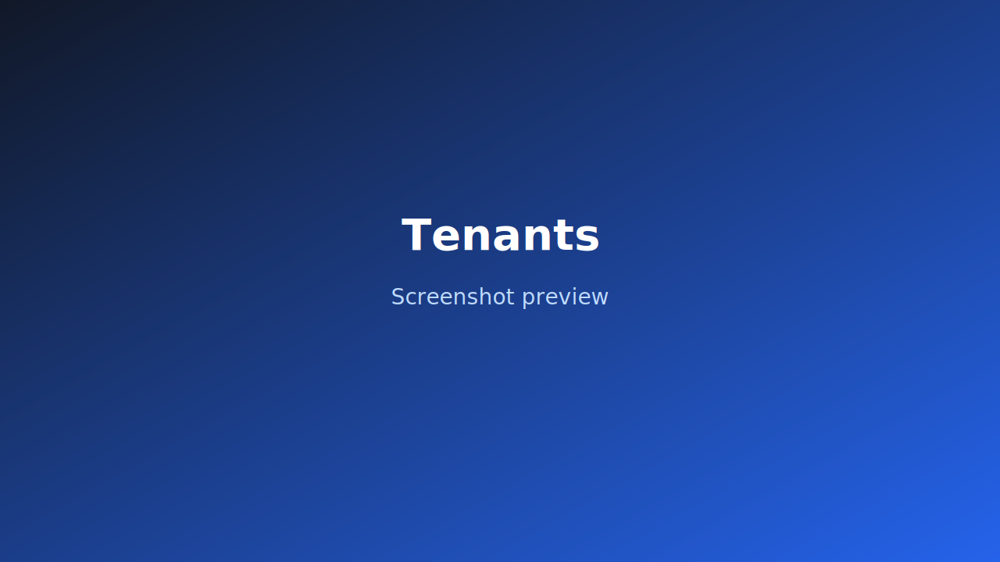
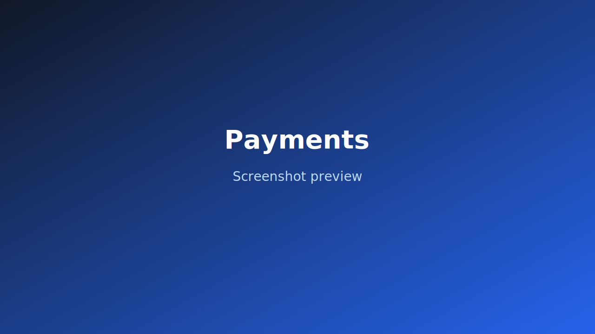
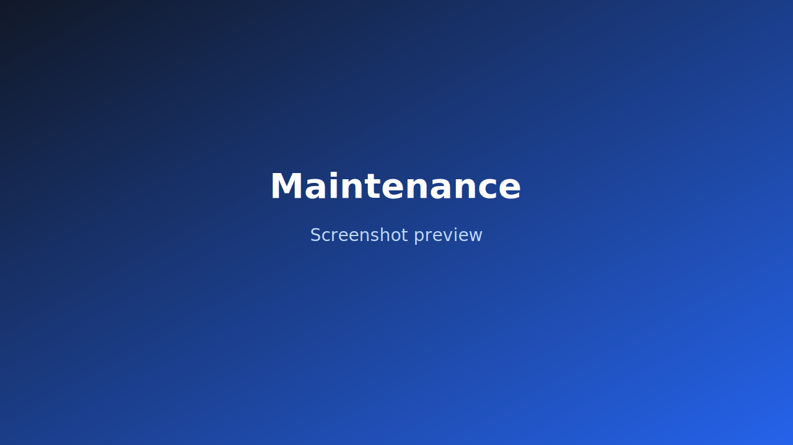

# 🏠 Property Management Platform

🎓 Student Full-Stack Project | Next.js + TypeScript

A modern dashboard-style property management application built as a student project to demonstrate full-stack architecture, UI structuring, and scalable frontend design using Next.js 14, TypeScript, and Tailwind CSS.

This project simulates a rental management system where landlords or property managers can monitor properties, tenants, payments, and maintenance tickets through a centralized dashboard.

## 📌 Project Overview

This application provides a clean, responsive admin-style interface to:

- View overall rental performance metrics
- Manage properties and occupancy
- Track tenant records
- Monitor rent payments
- Handle maintenance ticket workflows

⚠️ Currently powered by mock data for demonstration purposes.  
No authentication or database setup is required to explore the UI.

## 🛠 Tech Stack

| Technology | Purpose |
|---|---|
| Next.js 14 (App Router) | Full-stack React framework |
| React | UI rendering |
| TypeScript | Type safety & maintainability |
| Tailwind CSS | Utility-first styling |
| Prisma (planned) | ORM for database integration |
| PostgreSQL (planned) | Database backend |

## 🚀 How to Run Locally

```bash
npm install
npm run dev
```

Open your browser at:

`http://localhost:3000`

The home route automatically redirects to `/dashboard`.

## 📸 Application Screenshots

### 📊 Dashboard – `/dashboard`

Purpose: Quick system overview.

Displays:

- Total revenue
- Occupancy rate
- Pending payments
- Open maintenance tickets
- Charts & recent activity feed



### 🏢 Properties – `/properties`

Purpose: Property performance tracking.

Features:

- Property listing with occupancy details
- Unit overview
- Search / filtering
- Status insights



### 👥 Tenants – `/tenants`

Purpose: Tenant management interface.

Displays:

- Tenant profile cards / table
- Lease details
- Contact information
- Rental associations



### 💳 Payments – `/payments`

Purpose: Rent tracking and payment monitoring.

Features:

- Payment status indicators (Paid / Pending / Failed)
- Amount tracking
- Date logging
- Revenue visualization



### 🔧 Maintenance – `/maintenance`

Purpose: Ticket workflow simulation.

Includes:

- Priority tagging
- Status tracking
- Issue categorization
- Repair simulation lifecycle



> Note: The previous screenshot links pointed to a temporary local `browser:/tmp/...` path.
> Screenshots are now stored in `docs/screenshots/` so they render correctly in GitHub and other Markdown viewers.

## 📂 Project Structure

```text
src/app/
  dashboard/page.tsx
  properties/page.tsx
  tenants/page.tsx
  payments/page.tsx
  maintenance/page.tsx
```

The project follows the Next.js 14 App Router architecture.

## 🎯 Learning Objectives

This project was built to practice:

- Full-stack application structure
- Modular component design
- Clean UI dashboard architecture
- Scalable routing using App Router
- Type-safe development with TypeScript
- UI consistency using Tailwind utility patterns

## 🔮 Future Improvements

Planned enhancements:

- 🔐 Authentication & user roles
- 🗄 Database integration (Prisma + PostgreSQL)
- 📡 REST API integration
- 📊 Real dynamic analytics charts
- 📄 PDF / CSV report export
- 📱 Improved mobile responsiveness
- 🌍 Deployment (Vercel / Docker)

## 🧠 Key Design Decisions

- Dashboard-first architecture for quick executive view
- Modular page separation for scalability
- Clean utility-based styling over heavy UI libraries
- Mock data for rapid frontend iteration

## 👨‍💻 Author

Srekanth Namilakonda Venkata  
Master’s Student – Computing & Information Systems  
Full-Stack & DevOps Enthusiast

This project was developed as part of academic learning and portfolio building.

Feedback and suggestions are welcome 🙌
